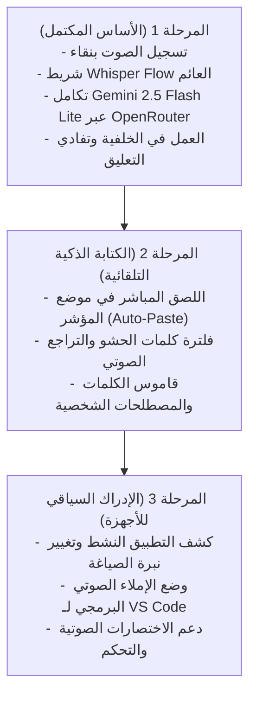

# وثيقة متطلبات المنتج (PRD) - تطبيق Souty (صوتي)
## الجيل القادم من الإملاء الصوتي والكتابة الذكية بالذكاء الاصطناعي (AI Voice-First Writing Layer)

---

## 1. الملخص التنفيذي والرؤية (Executive Summary & Vision)

**صوتي (Souty)** ليس مجرد أداة لتسجيل وتفريغ الصوت (Speech-to-Text)، بل هو **طبقة كتابة ذكية على مستوى نظام التشغيل (Voice-First Intelligent Writing Layer)** مستوحاة من التطبيقات العالمية الرائدة مثل **Wispr Flow** و **Superwhisper**.

الهدف الأساسي هو تمكين المستخدم من **الكتابة أسرع بـ 3 أضعاف بصوته** في أي مكان داخل نظام التشغيل (سواء في محادثات واتساب، كتابة إيميلات رسمية، تدوين الملاحظات، أو كتابة الأكواد والتوثيق البرمجي)، مع التركيز الاستراتيجي على **فهم اللهجات العربية (وبالأخص المصرية والخليجية والشامية) والمصطلحات التقنية والإنجليزية المدمجة**، وتحويل الكلام العفوي غير المنظم إلى نص مصقول واحترافي بنقرة زر.

---

## 2. المشكلة الحالية وفرصة السوق (Problem Statement & Market Gap)

### المشاكل في أدوات التفريغ الصوتي التقليدية:
1. **التفريغ الحرفي الأعمى (Blind Literal Transcription)**:
   - الأدوات التقليدية تفرغ كل حرف بصورة حرفية، بما في ذلك كلمات التردد والحشو الصوتي ("أمم"، "يعني"، "بص"، "أصل")، وجمل التراجع الذاتي ("لا مش دي.. قصدي كذا")، مما ينتج نصاً ركيكاً يحتاج وقتاً طويلاً لإعادة التحرير.
2. **ضعف فهم العامية واللغات الهجينة (Code-Switching)**:
   - معظم الحلول العالمية مصممة للغة الإنجليزية أو الفصحى المعيارية (MSA)، وتفشل تماماً عندما يتحدث المستخدم المصري أو العربي بمزيج من العامية والمصطلحات الإنجليزية (مثل: *"اعمل لي push للـ commit دي على الـ staging"*).
3. **غياب سياق التطبيق (Lack of App Context)**:
   - النصوص المفرغة لا تراعي المكان الذي يكتب فيه المستخدم؛ فطريقة الكتابة في Slack أو WhatsApp تختلف تماماً عن كتابة تقرير رسمي أو رسالة بريد إلكتروني.
4. **الانفصال عن بيئة العمل (Context Switching)**:
   - اضطرار المستخدم لفتح نافذة منفصلة، والتسجيل، والانتظار، ثم نسخ النص يدوياً ولصقه، يكسر تدفق العمل والتركيز.

---

## 3. دراسة وتحليل التطبيقات المشابهة (Benchmark & Competitive Landscape)

| التطبيق | نقاط القوة الرئيسية | القيود ونقاط الضعف | ما الذي يميز Souty عنه؟ |
| :--- | :--- | :--- | :--- |
| **Wispr Flow** (المرجع الأساسي) | - واجهة عائمة خفية وسريعة جداً.<br>- استيعاب السياق وتكييف النبرة بحسب التطبيق النشط.<br>- إزالة حشو الكلام وإصلاح التراجع الذاتي. | - اشتراك شهري مدفوع ومرتفع.<br>- تركز بشكل أساسي على الإنجليزية والأسواق الغربية، ودعمها للعامية العربية ضعيف. | - **دعم أصيل واستثنائي للعامية المصرية والعربية**.<br>- تكامل مفتوح ومرن عبر **OpenRouter** باستخدام مفتاح المستخدم الخاص بدون اشتراكات باهظة. |
| **Superwhisper** | - تشغيل محلي بالكامل عبر Whisper على معالجات Apple Silicon.<br>- حماية خصوصية عالية. | - محصور بنظام macOS بشكل رئيسي ومحدود على ويندوز.<br>- النماذج المحلية تستهلك موارد الجهاز والذاكرة بشكل كبير. | - يعمل بسلاسة فائقة على **ويندوز** وجميع الأجهزة عبر سحابة OpenRouter الخفيفة والسريعة جداً. |
| **Aqua Voice** | - محرر مستندات كامل يتحكم به بالصوت بالكامل مع إمكانية التعديل الحي ("امسح آخر جملة"، "استبدل كذا"). | - يعمل فقط داخل محرره الخاص (ليس نظامياً عبر كامل الويندوز). | - يعمل كنظام إملاء عام في **أي تطبيق أو نافذة** على الجهاز. |
| **AudioPen** | - ممتاز في تحويل التسجيلات الفوضوية إلى مقالات ومنشورات ملخصة. | - موجه لكتابة الملاحظات وليس للكتابة الحية والإملاء السريع في المحادثات. | - مخصص للكتابة الحية اللحظية (Instant Dictation & Typing). |

---

## 4. فلسفة المنتج الأساسية: ما وراء التفريغ الحرفي (Beyond Simple ASR)

يقوم تطبيق **Souty** على معمارية معالجة ثنائية المراحل (**Two-Stage Cognitive Pipeline**):


1. **المرحلة الأولى: الالتقاط الصوتي عالي السرعة (Instant Ingestion)**:
   - تسجيل فوري بنظام تدفق منخفض التأخير (Low Latency).
2. **المرحلة الثانية: التفكير وإعادة الصياغة بالذكاء الاصطناعي (LLM Post-Processing)**:
   - النموذج لا يكتفي بكتابة الكلمات، بل **يفهم المعنى والقصد**:
     - إزالة الترددات واللجلجة وحشو الكلام.
     - معالجة التراجع والتصحيح التلقائي أثناء الكلام (مثل: *"ابعت التقرير لمحمد.. لا خليها لأحمد"* -> يكتب مباشرة: *"ابعت التقرير لأحمد"*).
     - وضع الفواصل الطبيعية (،) والنقاط وعلامات الاستفهام وتقسيم الفقرات بدقة.
     - تكييف أسلوب الصياغة بناءً على السياق المطلوب.

---

## 5. الميزات والخصائص الوظيفية الأساسية (Core Functional Requirements)

### 5.1. شريط التسجيل العائم بنمط Wispr Flow (Floating Pill Overlay)
- **اختصار عام على مستوى النظام (`Ctrl + Space`)**:
  - استدعاء الشريط العائم فوراً أثناء استخدام أي برنامج دون الحاجة للتبديل بين النوافذ.
- **تصميم Minimalist زجاجي (Dark Glassmorphism)**:
  - شريط بيضاوي صغير عائم أسفل الشاشة أو ملاصق للمؤشر.
  - وميض أحمر متوهج (Pulsing Record Dot) وعداد زمني.
  - موجات صوتية حية (Dynamic Visualizer Waves) تعكس نبرة الصوت لحظياً.
- **سلاسة الإنهاء والإخفاء**:
  - ضغطة واحدة إضافية على الاختصار تنهي التسجيل، وتفرغ النص، وتنسخه للحافظة وتخفي الشريط خلال ثانية واحدة.

### 5.2. التفريغ الذكي وفهم العامية والمصطلحات التقنية (Dialect & Code-Switching)
- **اللهجة المصرية والعربية الدارجة**:
  - تمييز الكلمات المصرية الدارجة وكتابتها بإملائها السليم والمتعارف عليه.
- **الكود سويتشينج (العربية + الإنجليزية)**:
  - عند نطق كلمات إنجليزية تقنية أو أسماء أدوات وبرمجيات (مثل: *Docker, Git, Controller, API, Bug, Frontend*)، يتم التقاطها وكتابتها بالإنجليزية تلقائياً بحروفها الصحيحة وسط النص العربي.

### 5.3. الإدراك السياقي للتطبيقات (App-Aware Context Adaptation) - ميزة مستقبلية مستوحاة من Flow
- تمييز النافذة النشطة تلقائياً وتعديل أسلوب النص:
  - **محادثات (WhatsApp, Slack, Telegram)**: صياغة عفوية، سريعة، ودية، مع دعم الإيموجي المناسب.
  - **البريد الإلكتروني والمستندات (Gmail, Outlook, Word, Notion)**: صياغة احترافية، تدقيق إملائي صارم، وفقرات مهذبة.
  - **محررات الأكواد (VS Code, Cursor, Windsurf)**: صياغة مخصصة لتعليقات الكود (Code comments)، أو توثيق الدوال، أو أوامر موجهة للـ AI.

### 5.4. اللصق المباشر الذكي (Direct Auto-Paste Injection)
- بدلاً من الاكتفاء بالنسخ إلى الحافظة فقط:
  - محاكاة الضغط التلقائي على `Ctrl + V` فور اكتمال التفريغ لكتابة النص مباشرة في الحقل النشط الذي كان المستخدم يقف عليه.

### 5.5. القاموس الشخصي والمختصرات (Personal Vocabulary & Snippets)
- إمكانية تعريف كلمات خاصة، مثل:
  - أسماء أشخاص، أسماء شركات ومشاريع محلية.
  - مصطلحات فنية واختصارات (مثل: إذا قلت *"كود المشروع"* يكتب رقم تعريف المشروع).

---

## 6. المعمارية التقنية المقترحة (Technical Architecture)

```
┌─────────────────────────────────────────────────────────────┐
│                    User Desktop Interface                   │
│  [Active App: VS Code / WhatsApp / Browser / Word / Slack]   │
└──────────────────────────────┬──────────────────────────────┘
                               │  Global Hotkey (Ctrl + Space)
                               ▼
┌─────────────────────────────────────────────────────────────┐
│                  Electron / Native OS Layer                 │
│  ├── Global Shortcut Hook (uIOhook / Electron globalShortcut)│
│  ├── Transparent Floating Window (Always-on-top, ScreenSaver)│
│  ├── Native Audio Streamer (Web Audio API / 16kHz PCM / Opus)│
│  └── System Tray Daemon (Background Persistence)            │
└──────────────────────────────┬──────────────────────────────┘
                               │  Fast HTTP / WebSocket Stream
                               ▼
┌─────────────────────────────────────────────────────────────┐
│                   OpenRouter Cloud Pipeline                 │
│  ├── Multi-modal Audio Ingestion (WAV / WebM Opus)           │
│  ├── Primary Model: Google Gemini 2.5 Flash Lite            │
│  │   (Ultra-low latency, deep audio comprehension, ~1.2s)   │
│  ├── Fallback / High-Precision: Gemini 2.5 Flash / Whisper  │
│  └── Strict 15s Watchdog & AbortController                  │
└──────────────────────────────┬──────────────────────────────┘
                               │  Transcribed & Formatted Text
                               ▼
┌─────────────────────────────────────────────────────────────┐
│                 Output & Automation Engine                  │
│  ├── Clipboard Injection (Native Clipboard API)             │
│  ├── Auto-Paste Trigger (robotjs / sendkeys / PowerShell)   │
│  └── Local History Sync (SQLite / JSON Store)               │
└─────────────────────────────────────────────────────────────┘
```

---

## 7. رحلة وتجربة المستخدم (User Journey & Experience)

1. **الاستدعاء**:
   - المستخدم يكتب في مستند وورد أو يدردش على تيليجرام.
   - يضغط `Ctrl + Space`.
2. **الاستماع**:
   - ينبثق شريط زجاجي عائم أسفل الشاشة بنبضات صوتية فورية.
   - يتحدث المستخدم بعفوية بالعامية أو بمزيج لغوي.
3. **الإنهاء والتفريغ**:
   - يضغط `Ctrl + Space` مرة أخرى.
   - خلال ثانية واحدة (~1s) يتحول الشريط لمؤشر أخضر مع علامة ✓ "تم النسخ!".
4. **التطبيق**:
   - يجد المستخدم النص مكتوباً ومفصولاً بالفواصل والنقاط، وجاهزاً للإرسال فوراً.

---

## 8. خارطة الطريق ومراحل التطوير (Product Roadmap)



---

## 9. معايير النجاح ومؤشرات الأداء (Key Performance Indicators)

1. **زمن الاستجابة الكلي (End-to-End Latency)**: أقل من **1.5 ثانية** من لحظة إنهاء التسجيل وحتى ظهور النص المفرغ.
2. **دقة التعرف على العامية المصرية والعربية (Dialect Accuracy)**: أكثر من **95%** من الكلمات المكتوبة مطابقة للهجة المحكية دون استبدال خاطئ.
3. **دقة الترقيم والوقفات (Punctuation Precision)**: وضع الفواصل والنقاط في مواضعها الطبيعية بنسبة تفوق **90%**.
4. **معدل استقرار البرنامج (Stability & Crash-Free Rate)**: **99.9%** استقرار دون أي تجميد أو تعليق للودجت العائم.
